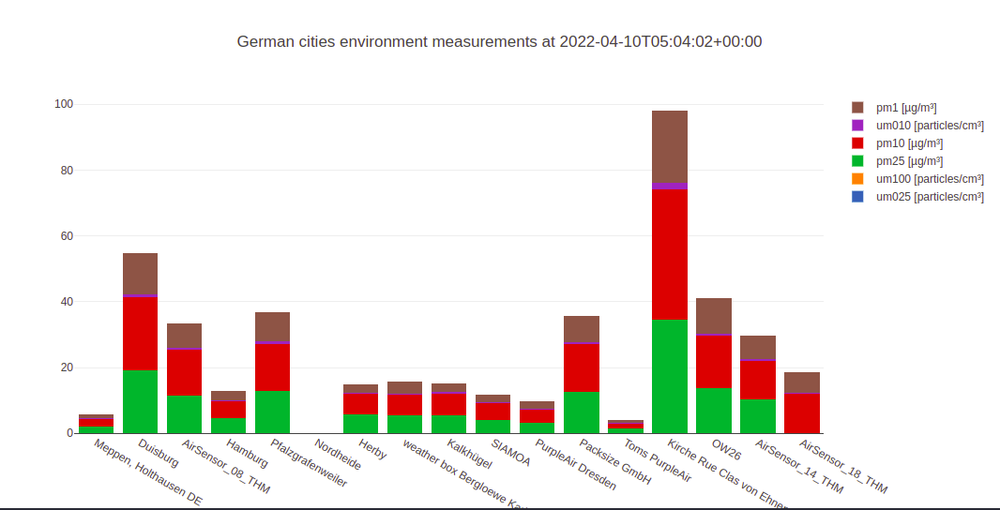
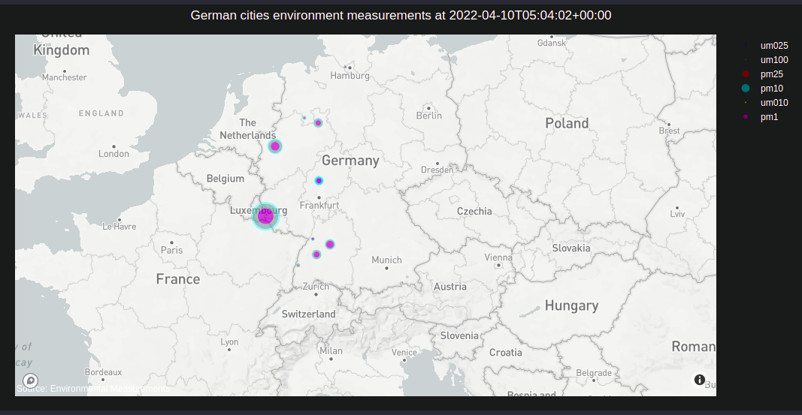

# Germany Environmental Measurements Data Visualization

### An Introduction Of The Application

This is a small frontend application, which visualizes the environmental measurements data of German cities. The data was collected from an API, which is provided by OpenAQ. OpenAQ is a non-profit organization empowering communities around the globe to clean their air by harmonizing, sharing, and using open air quality data. Read more [openaq.org](https://openaq.org/#/)

Some screenshots from the application

### Tech stack
- **React.js**: it is a free and open-source Javascript framework/library for building user interfaces based on UI components.
- **Plotly.js**: it is an open-source graph library, which built on top of d3.js and stack.gl. Plotly.js is a high-lvel, declarative charting library.

### Run The Application
1. Clone this Github repository
2. Go to my_secret_app folder
3. Run `npm install`
4. Run `npm start`
5. Open [http://localhost:3000](http://localhost:3000) to view it in your browser.

